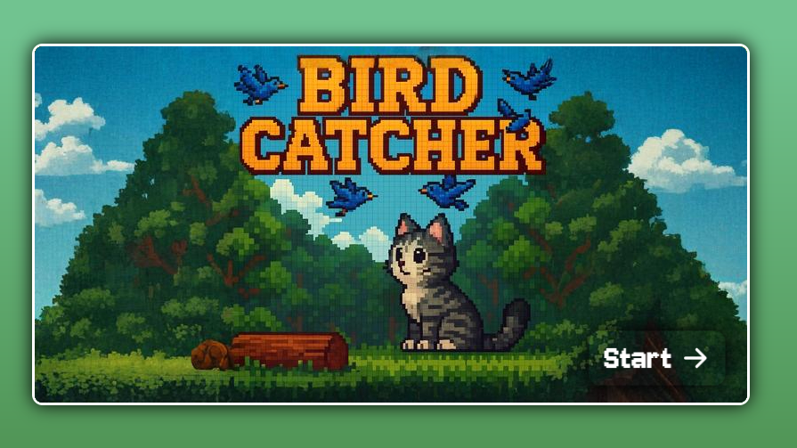

# 🐱 Bird Catcher - Proyecto de Juego con JavaScript

**Bird Catcher** es un juego desarrollado en HTML, CSS y JavaScript puro, creado como práctica de desarrollo de aplicaciones interactivas.

En este proyecto, controlás a un gato que corre por un escenario con efecto *parallax*, esquivando obstáculos y recolectando objetivos o ítems de bonus. 

## ✨ Características del proyecto

- Animaciones con CSS y transiciones suaves
- Efecto *parallax* con múltiples capas
- Control de personaje con salto y doble salto
- Uso de `setTimeout` y `setInterval` para generación de obstáculos, objetivos y bonus
- Lógica de colisiones y puntuación
- Sprites animados con hojas de sprites (spritesheets)
- Integración de *assets* personalizados (imágenes de botones, fondo, personajes, etc.)

## 🧰 Tecnologías utilizadas

- HTML5 + CSS3
- JavaScript (ES6)
- Archivos de imagen y hojas de sprites para los elementos gráficos

## 🖼 Vista previa de la pantalla principal

> 📸 
> 

## 🤝 Autor

Trabajo realizado por **Melanie San Román** 💻  